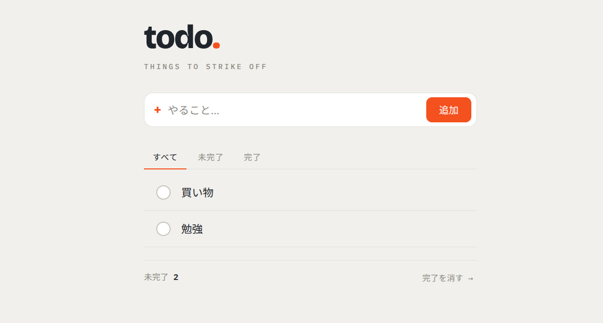

# todo-app-java

Java・Spring Boot・MyBatis・H2 を使った Todo REST API の学習用プロジェクトです。
TodoMVC 相当のコア機能（追加・編集・完了切替・削除・完了フィルター・完了済み一括削除）に絞った
**MVP（最小機能版）** として実装します。スコープの詳細は [doc/design.md §1.1](doc/design.md) を参照。

## スクリーンショット



`src/main/resources/static/` に配置した Alpine.js ベースの SPA を `http://localhost:8080` で表示した状態です。

## 技術スタック

| 項目 | 技術 |
|---|---|
| 言語 | Java 25 |
| フレームワーク | Spring Boot 4.0.x / Spring Framework 7.0 |
| DB アクセス | MyBatis |
| データベース | H2（ファイルベース） |
| ビルド | Gradle 9 |

## セットアップ

必要環境: JDK 25

```bash
./gradlew bootRun
```

起動後、<http://localhost:8080> にアクセスできます。

## ビルド・テスト

```bash
./gradlew build  # ビルド + テスト
./gradlew test   # テスト実行
```

## ディレクトリ構成

```text
todo-app-java/
├── build.gradle                              # 依存関係・ビルド設定
├── src/
│   ├── main/
│   │   ├── java/io/github/futomaru/todoapp/
│   │   │   ├── TodoappApplication.java       # エントリポイント (Clock Bean を定義)
│   │   │   ├── controller/                   # REST エンドポイント
│   │   │   ├── service/                      # ビジネスロジック・@Transactional 境界
│   │   │   ├── mapper/                       # MyBatis @Mapper (SQL アノテーション)
│   │   │   ├── entity/                       # DB に対応する可変 POJO
│   │   │   ├── dto/                          # API 入出力 (不変 record)
│   │   │   └── exception/                    # カスタム例外 + ProblemDetail 変換
│   │   └── resources/
│   │       ├── application.properties        # H2 / MyBatis / Virtual Threads 設定
│   │       ├── schema.sql                    # DDL (CREATE TABLE IF NOT EXISTS)
│   │       └── static/                       # Alpine.js SPA (index.html / app.js / style.css)
│   └── test/
│       ├── java/io/github/futomaru/todoapp/
│       │   ├── TodoappApplicationTests.java  # 結合テスト (@SpringBootTest)
│       │   ├── controller/                   # RestTestClient (standalone) + Mockito
│       │   ├── service/                      # JUnit 5 + Mockito + Clock.fixed
│       │   └── mapper/                       # @MybatisTest
│       └── resources/
│           └── application-test.properties   # in-memory H2 プロファイル
└── doc/
    ├── architecture.md     # 全体構成 (What)
    ├── design.md           # 設計判断の理由 (Why)
    ├── coding-standards.md # コーディング規約
    ├── testing-guide.md    # テスト方針
    ├── api.yaml            # OpenAPI 3.0 API 仕様
    ├── git.md              # Git 運用ルール
    └── todo.png            # 画面スクリーンショット
```

## ドキュメント

- [アーキテクチャ](doc/architecture.md)
- [設計](doc/design.md)
- [コーディング規約](doc/coding-standards.md)
- [テストガイド](doc/testing-guide.md)
- [API 仕様（OpenAPI 3.0）](doc/api.yaml)
- [コントリビューション（準備中）](doc/CONTRIBUTING.md)
